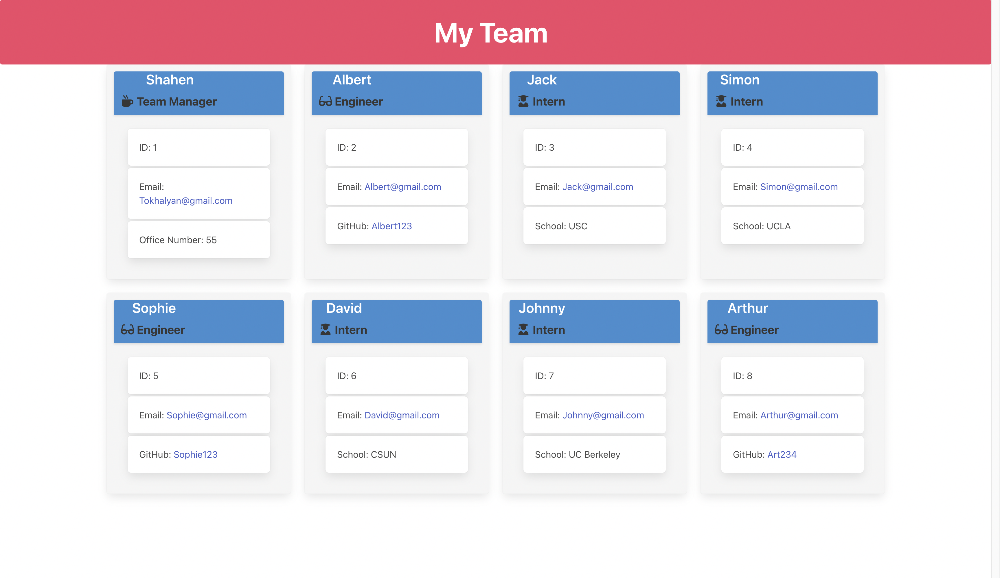

# Team-Tracker

## User Story 

* AS A manager
* I WANT to generate a webpage that displays my team's basic info
* SO THAT I have quick access to their emails and GitHub profiles

-----------------------------------------------------------------

* GIVEN a command-line application that accepts user input
* WHEN I am prompted for my team members and their information
* THEN an HTML file is generated that displays a nicely formatted team roster based on user input
* WHEN I click on an email address in the HTML
* THEN my default email program opens and populates the TO field of the email with the address
* WHEN I click on the GitHub username
* THEN that GitHub profile opens in a new tab
* WHEN I start the application
* THEN I am prompted to enter the team manager’s name, employee ID, email address, and office number
* WHEN I enter the team manager’s name, employee ID, email address, and office number
* THEN I am presented with a menu with the option to add an engineer or an intern or to finish building my team
* WHEN I select the engineer option
* THEN I am prompted to enter the engineer’s name, ID, email, and GitHub username, and I am taken back to the menu
* WHEN I select the intern option
* THEN I am prompted to enter the intern’s name, ID, email, and school, and I am taken back to the menu
* WHEN I decide to finish building my team
* THEN I exit the application, and the HTML is generated

## Description

* Team-Tracker is a command-line application that accepts user input
* All interaction with the user goes through the terminal
* When user runs the application prompt questions will be asked.
* User will be asked to enter:
- Manager's name
- Manager's ID
- Manager's Email address
- Manager's office number

* User will be asked if he would like to add an Engineer or an Intern
* User must add at least one employee (Engineer or Intern)
* If user selected 'Engineer'
* User will be asked to enter:
- Engineer's name
- Engineer's ID
- Engineer's Email address
- Engineer's Github username

* User will be asked if he would like to add an Engineer, an Intern or to build the page
* If user selected 'Intern'
* User will be asked to enter:
- Intern's name
- Intern's ID
- Intern's Email address
- Intern's School Name

* User will be asked if he would like to add an Engineer or an Intern
* User can add unlimited employees to the page
* If user selected 'Build my page'
* 'index.html' file will be generated which will include all the user input

## Instructions
* Run the code in terminal (node index)
* Answer the questions about the employees
* WHEN user answers to all the questions, message ''index.html' file is created! Check dist/' will appear
* 'index.html' file will be generated in dist/ folder

## Build With
* JavaScript
* Node.js

## Packages used
* Inquirer
* Jest
* Bulma

## Contribution
Made with ❤ by Shahen Tokhalyan

## Walkthrough Video: 
https://drive.google.com/file/d/1wPELKSlItVT4zVxX5swFGtsTqrRD3A9R/view?usp=sharing

